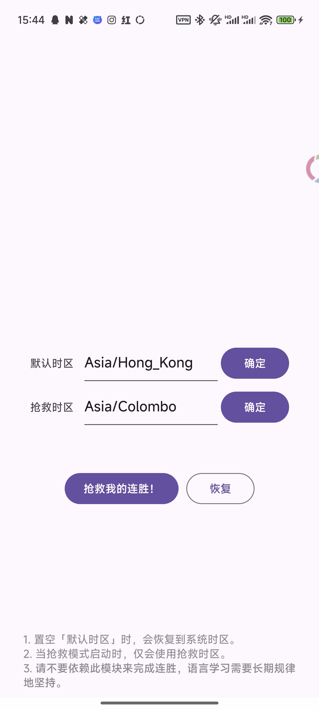

# 多邻国后悔药 Duolingo Regret
将多邻国的时区修改为任意时区，便于回到过去做完忘了做的连胜。对特定地区来说，可以通过修改默认时区防止账户被判定为某些地区账户。

Change Duolingo's time zone to any arbitrary time zone, makes it easier to go back and finish forgotten streaks. For specific regions, modifying the time zone can prevent accounts from being classified as accounts from certain areas.

# 截图 Screenshots

